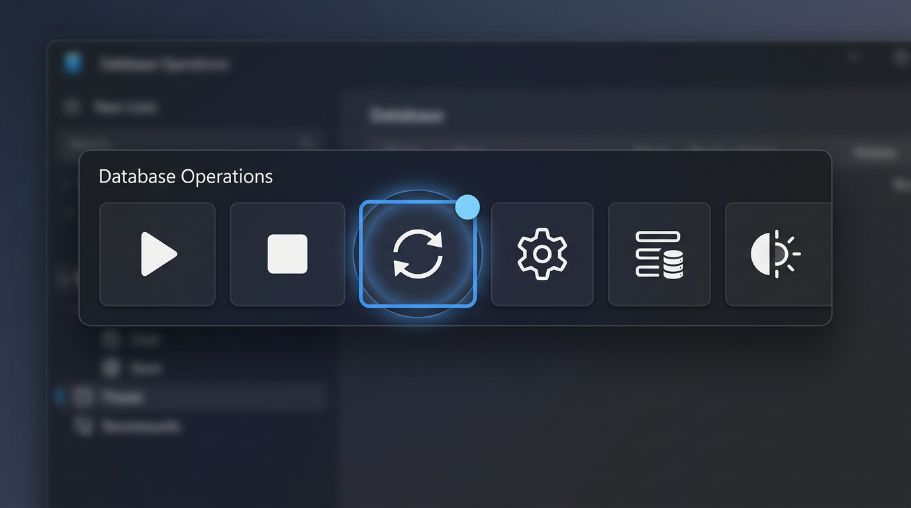
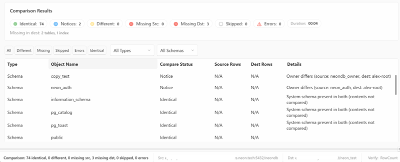

# Database Comparison

DbClone includes a standalone comparison feature that lets you diff two databases without copying anything.

## Opening the Comparison

1. Select source and destination connections on the main screen
2. Switch the toolbar to **Compare** mode
3. Click the run button (▶) — or press ++ctrl+shift+c++

{ loading=lazy }

## What Gets Compared

The comparison checks multiple object types with varying levels of detail:

### Tables (structural DDL diff)

Beyond presence and row counts, DbClone performs a detailed structural comparison of each table:

- **Columns** — name, data type, nullability, default values, identity/generated columns
- **Primary keys** — column list comparison
- **Foreign keys** — name, columns, referenced schema/table/columns, update/delete rules
- **Check constraints** — expression comparison with normalization (handles PostgreSQL decompiler variance across versions, including partition-inherited constraints)
- **Unique constraints** — name and column list

### Other Object Types

- **Indexes** — presence and definition (columns, uniqueness, filter)
- **Views** — presence and query definition
- **Materialized Views** — presence and query definition
- **Functions / Procedures** — presence and body definition
- **Sequences** — presence and configuration (data type, increment, bounds, cycling); identity backing sequences are excluded (non-deterministic names across databases)
- **Triggers** — presence and definition (timing, events, function, level)
- **Enums** — presence and label list
- **Domains** — presence and definition (base type, constraints)
- **Composite Types** — presence and attribute definitions

## Result Statuses

{ loading=lazy }

Each compared object gets a status:

| Status | Icon | Meaning |
|--------|------|---------|
| **Identical** | 🟢 | Same object, same definition/row count |
| **Notice** | 🟡 | Object matches structurally but carries a non-structural note (e.g. schema owner differs, partition CHECK normalization artifact). Does not count as a real difference |
| **Different** | 🟠 | Object exists on both but definition or row counts differ |
| **Missing Source** | 🔴 | Object exists on destination but not source |
| **Missing Dest** | 🔵 | Object exists on source but not destination |
| **Skipped** | ⚪ | Object exists in both but could not be compared (e.g. insufficient permissions) |
| **Error** | ⚠️ | Couldn't compare (permission issue, timeout) |

### Notice vs Different

The **Notice** status is one level below **Different**. It indicates a cosmetic or environmental difference that does not represent a real structural divergence between the databases. Examples:

- A CHECK constraint expression that PostgreSQL decompiles differently across versions (normalized automatically)
- A CHECK constraint difference on a partition child (inherited from parent — the parent is the source of truth)
- Schema owner differences

Notices are shown in the results but do not count toward the "differences" total.

## Comparison Modes

Same as validation modes:

- **Row Count** — fast, compares only `COUNT(*)`
- **Checksum** — compares MD5 of content
- **Full** — count + checksum

## Export Report

After comparison, click **Report** in the toolbar to open the comparison report window. From its toolbar you can export results as:

- **HTML** — formatted report for sharing
- **Markdown** — for documentation or version control
- **JSON** — machine-readable format
- **Copy to Clipboard** — plain text summary

## Use Cases

- **Pre-copy check** — see what's different before running a copy
- **Post-copy verification** — confirm the copy was successful
- **Drift detection** — check if staging has drifted from production
- **Audit** — document database state at a point in time
