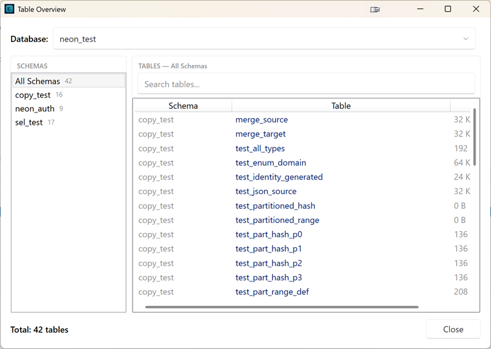

# Table Overview (Destination)

The destination connection panel includes a **read-only overview of all tables** currently on the output database:

```
Tables:  All Tables   47 tables   [ View… ]
```

Click **View…** to open the Table Overview dialog. It shows what is actually on the destination right now — useful to check what a previous copy left behind before you clean or overwrite it.

{ loading=lazy }

## What the dialog shows

- **Database dropdown** (top) — the database of the destination connection; see [Picking a database](#picking-a-database-when-none-is-configured) below
- **Schema tree** (left) — an **All Schemas** entry plus one entry per schema, each with its table count
- **Table list** (right) — Schema, Table, and Size columns; every column is sortable (sort by size to find the largest tables)
- **Search** — filter tables by name or schema
- **Total count** — number of tables in the current view

Sizes are estimates from the database catalog (`pg_total_relation_size`) — instant to read, no table scans. Tables whose size cannot be read show a blank cell and sort last.

The overview is strictly read-only: it never changes anything on the destination.

## Picking a database when none is configured

If the destination connection has **no database name**, the destination panel shows `(no database)`. Open the overview anyway: the **Database** dropdown lists all databases on the server, and picking one applies it directly to the destination connection — no need to edit the connection in the Connection Manager first.

## Typical uses

- Inspect the destination before a **Full** copy to see exactly what the cleanup will drop
- Verify the contents of a previous copy or backup restore
- Find the largest tables on the destination

!!! note "Copy modes still require a destination database"
    Full, Resume, and Update cannot run without a destination database name. Connections without a database can only be used for Backup mode (which creates its own timestamped database).
