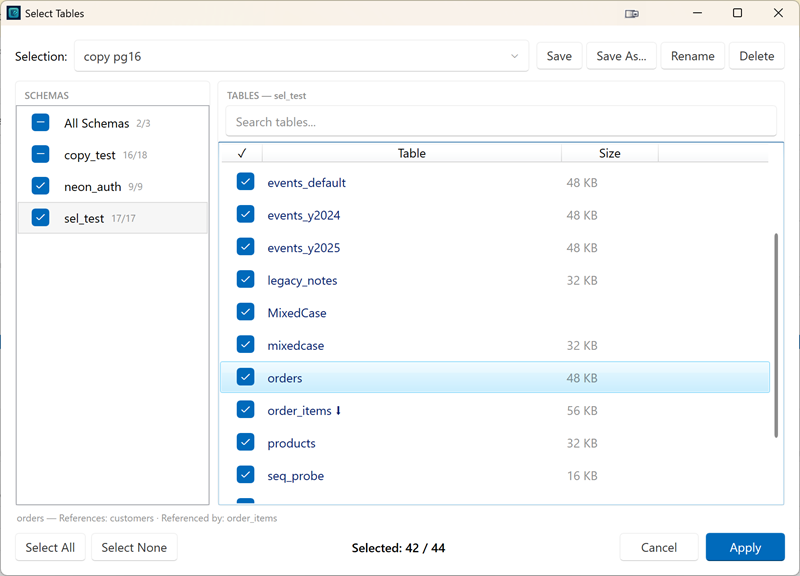
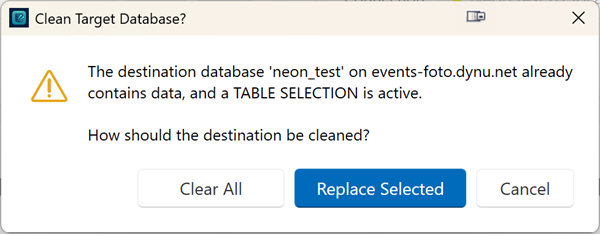

# Table Selection

By default, DbClone processes **every table** it has permission to access. With table selection you can choose exactly which tables a Copy, Compare, or Backup operation processes for a source database.

The control lives on the **source connection panel**:

```
Tables:  [ All Tables ▼ ]   [ Edit… ]
```

- **All Tables** (built-in default) — no filtering; DbClone behaves exactly as before
- Named selections you create yourself (see [Named Selections](#named-selections-presets))
- A `*` after the name (e.g. `My Selection *`) means the active selection has unsaved modifications

## The Selection Dialog

Click **Edit…** on the source panel to open the table selection dialog:

{ loading=lazy }

- **Schema tree** (left) — one checkbox per schema with a `selected/total` count; an **All Schemas** entry shows every table in one list
- **Table list** (right) — checkbox, table name, and estimated size; every column is sortable (sort by size to quickly find the largest tables)
- **Search** — filter tables by name within the current schema or across all schemas; searching never changes the selection itself
- **Select All / Select None** — act on the entire database, not just the currently filtered view
- **Relationship explorer** — highlight a table row to see its foreign-key relationships; dependent tables are marked, and tooltips show which tables the row references and is referenced by, including whether each related table is currently selected or excluded

### Foreign-key behavior

- **Unchecking a parent table** asks for confirmation listing its dependent child tables, then deselects them automatically (recursively). This prevents orphaned child data that would violate referential integrity.
- **Re-selecting a child table** whose parent is still excluded highlights the row with a warning — the copy would break the FK relationship.

### Validation summary

Before applying a selection, DbClone checks dependencies and shows a summary of what will be skipped during the operation:

- Foreign keys that reference excluded tables
- Views and materialized views that depend on excluded tables
- Orphaned partitions (partition selected but parent excluded, or vice versa)

The summary is informational only — you can **Go Back** and adjust, or **Apply Anyway**. If the selection is clean, no summary is shown.

## Named Selections (Presets)

Selections are stored as **named presets per source connection and database**:

- **Save** overwrites the active preset; **Save As…** creates a new one
- **Rename** and **Delete** manage existing presets ("All Tables" cannot be changed or deleted)
- The **last-used preset is restored automatically** when you select the connection again
- Unsaved (dirty) modifications survive an application restart

Presets store the tables you **unchecked** — not an explicit include-list. Consequences:

- Tables added to the database later are **included automatically** (they're not in the exclusion list). If you don't want them, open the dialog and uncheck them.
- Tables that were deleted from the database are silently ignored.

## How Operations Use the Selection

The active selection applies to **Copy, Compare, and Backup** alike. Objects that belong to an excluded table (its data, indexes, own foreign keys, triggers) are excluded with it. Schemas, sequences, functions, types, and extensions are not affected by table selection.

### Copy

Only the selected tables are created and copied. When the destination **already contains data**, DbClone asks how it should be cleaned:

{ loading=lazy }

| Choice | Effect |
|--------|--------|
| **Replace Selected** (default) | Only the selected tables are dropped and re-created — all other destination tables remain untouched |
| **Clear All** | The entire destination is cleared — after the copy it contains *only* the selected tables |
| **Cancel** | Abort the operation |

Without a table selection, the classic Yes/No overwrite confirmation is used.

### Compare

The selection defines the comparison scope on **both sides**:

- Target tables outside the selection are ignored and are **not** reported as differences
- Views depending on excluded tables are reported as skipped
- Non-table objects (sequences, types, functions, schemas) are still compared in full

### Backup

Backup honors the selection — unselected tables are excluded from the backup file, and views depending on excluded tables are skipped with a warning.

### Resume / Update

Resume and Update modes **require "All Tables"**. While a non-default selection is active they are blocked with an explanation — switch back to **All Tables** to use them.

## Dependency handling at runtime

The operation never fails because of a filtered table — it skips and reports:

| Situation | Behavior |
|-----------|----------|
| Selected table has an FK to an excluded table | That FK constraint is skipped, warning logged |
| View / materialized view depends on an excluded table | View is skipped, warning logged |
| Partition selected but parent excluded (or vice versa) | Orphaned partition is skipped, warning logged |
| Trigger on an excluded table | Automatically excluded with the table |

## Destination Table Overview

The **destination panel** offers a separate read-only overview of all tables currently on the output database, including a database picker when the destination connection has no database name — see [Table Overview (Destination)](table-overview.md).
