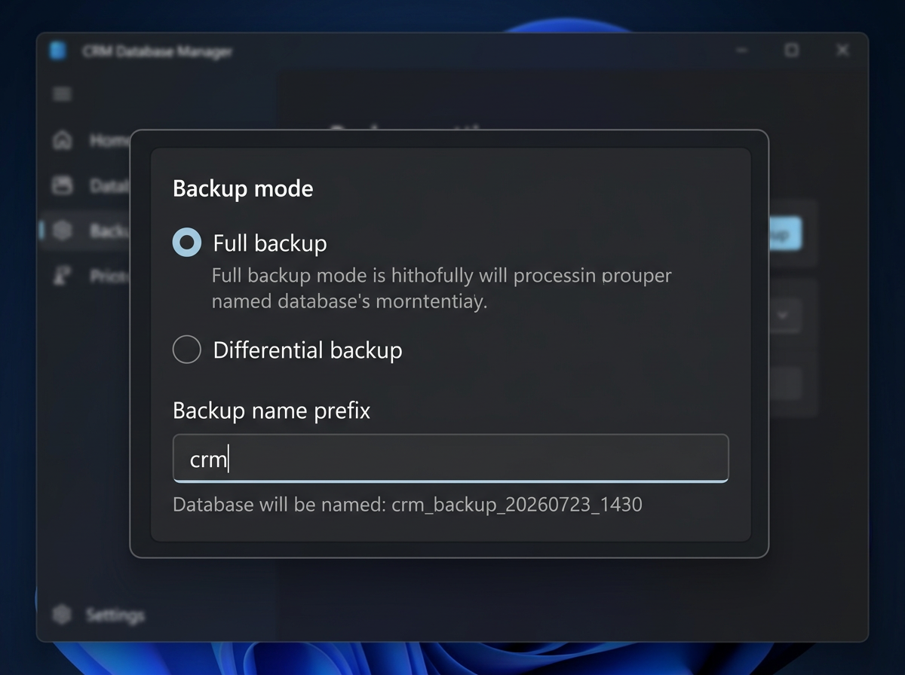

# Backup Mode

Backup mode creates a timestamped copy of your database into a new database on the destination server.

## When to Use

- You want a point-in-time backup before making changes
- Creating a snapshot before a migration
- Keeping historical copies on the same server

## What Happens

1. **Creates a new database** — auto-named with timestamp (e.g., `my_app_backup_20260723_1430`)
2. **Runs a Full copy** into the newly created database
3. **Leaves the original destination untouched**

## Database Naming

The backup database name follows the pattern:

```
{original_name}_backup_{YYYYMMDD}_{HHmm}
```

You can customize the backup name in the options panel before starting.

{ loading=lazy }

## Requirements

- The destination connection user must have `CREATEDB` privilege
- Enough disk space on the destination server for the backup

!!! warning "Backup is on the destination server"
    Backup mode creates the new database on the **destination** server, not the source. If you want a backup on the same server as the source, set both source and destination to the same server (different database names).

## Tips

- Backup databases accumulate over time — periodically clean up old ones
- Combine with a scheduled task for automated daily backups
- The backup database is fully independent — you can connect to it and query it directly
