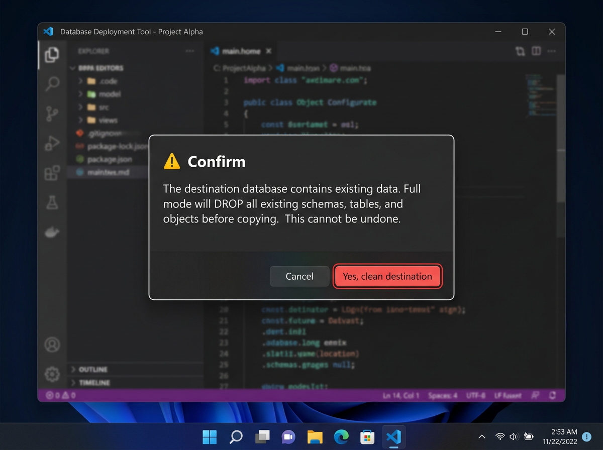

# Full Copy

Full mode performs a complete clone of the source database to the destination.

## When to Use

- First-time cloning to a fresh, empty database
- Replacing a previous copy entirely
- Setting up a development environment from production

## What Happens

1. **Cleans destination** — drops all existing schemas, tables, and objects (after confirmation)
2. **Creates schema** — schemas, extensions, sequences, types, functions (first pass), tables (without FKs)
3. **Copies data** — binary COPY for all tables with progress tracking
4. **Creates objects** — constraints, indexes, retried functions, views, triggers
5. **Validates** — compares row counts between source and destination

## Confirmation Prompt

If the destination database contains existing data, DbClone shows a confirmation dialog:

{ loading=lazy }

!!! danger "Destructive operation"
    Full mode **drops all existing data** in the destination database. Make sure you've selected the correct destination.

## Pipeline Stages

```
Connect → DetectCapabilities → ReadMetadata → AnalyzeDependencies
→ CreateSchemas → CreateExtensions → CreateSequences → CreateTypes
→ CreateFunctions → CreateTables → ReconcileColumns → CopyData
→ CreateIndexes → CreateConstraints → SyncSequences → RetryFunctions
→ CreateViews → CreateTriggers → Validate → ReCopyMismatched
```

## Tips

- Use an **empty** destination database for the cleanest results
- If you need to preserve the current destination, use [Backup mode](backup.md) first
- For large databases (50GB+), consider running during off-peak hours for better network throughput
