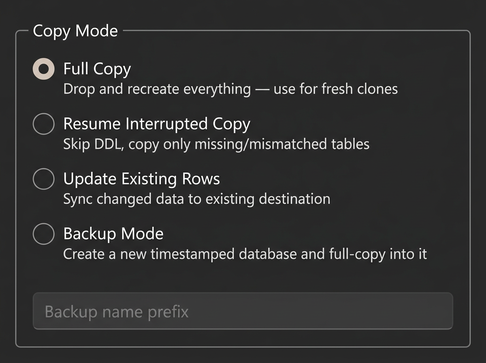
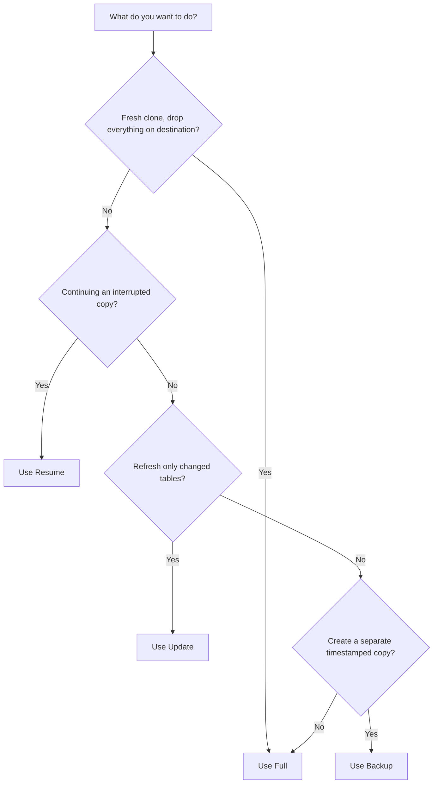

# Copy Modes

DbClone offers four copy modes to match different scenarios:

| Mode | Use Case | Destination State |
|------|----------|-------------------|
| [**Full**](full.md) | Fresh clone | Empty (existing data will be cleaned) |
| [**Resume**](resume.md) | Interrupted copy | Partially copied (schema exists) |
| [**Update**](update.md) | Sync changed tables | Already contains data |
| [**Backup**](backup.md) | Point-in-time backup | New database created automatically |

{ loading=lazy }

## Choosing the Right Mode

## Common to All Modes

Regardless of mode, DbClone always:

- Detects extension-owned objects and skips them
- Resolves dependency ordering
- Reports progress per table
- Isolates errors (one table failing doesn't stop the rest)
- Runs validation at the end
