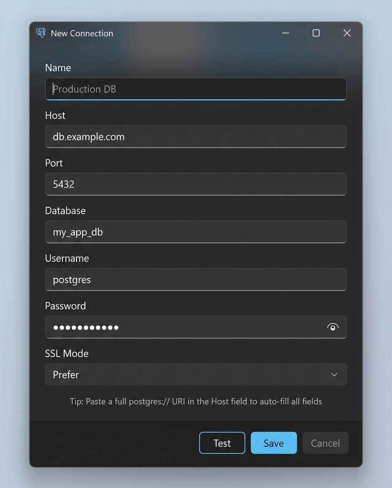
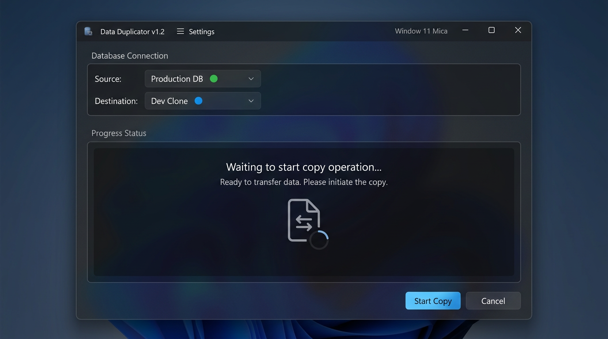
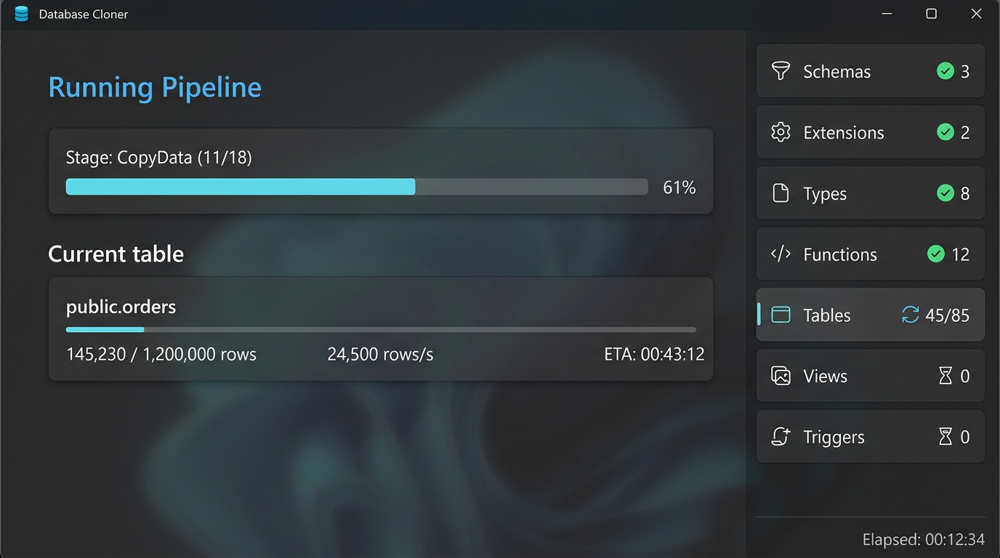
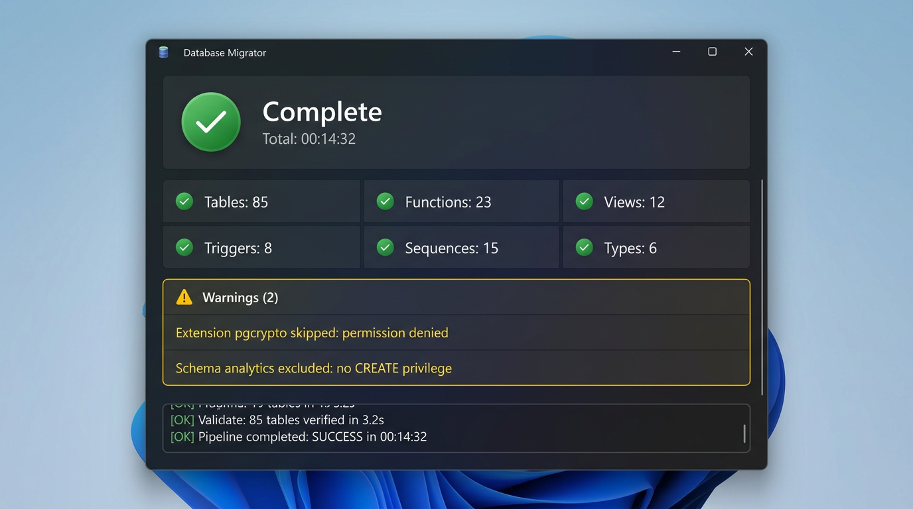

# First Copy — Quick Start

This guide walks you through cloning a database in under 5 minutes.

## Step 1: Add Source Connection

1. Click **Manage Connections** in the toolbar
2. Click **+ New Connection**
3. Paste your connection URI or fill in the fields:
    - Host: `your-server.example.com`
    - Port: `5432`
    - Database: `my_app_db`
    - Username: `postgres`
    - Password: `••••••••`
4. Click **Test** to verify the connection
5. Click **Save**

{ loading=lazy }

## Step 2: Add Destination Connection

Repeat the same process for your destination database.

!!! warning "Destination must exist"
    DbClone does not create the destination database itself. Create an empty database on your target server first (e.g. `CREATE DATABASE my_app_clone;`).

## Step 3: Select Source & Destination

Back on the main screen, select your source and destination from the dropdowns.

{ loading=lazy }

## Step 4: Start the Copy

1. Leave the default settings (Full mode, all objects selected)
2. Click **Start Copy**
3. If the destination has existing data, DbClone will ask for confirmation before cleaning it

{ loading=lazy }

## Step 5: Review Results

When complete, you'll see:

- ✅ Green status for successful stages
- A summary of objects copied (tables, functions, views, etc.)
- Any warnings or errors in the log panel

{ loading=lazy }

## What's Next?

- [Copy Modes](../copy-modes/overview.md) — learn about Resume, Update, and Backup modes
- [Options](../options.md) — customize what gets copied
- [Troubleshooting](../troubleshooting.md) — if something went wrong
