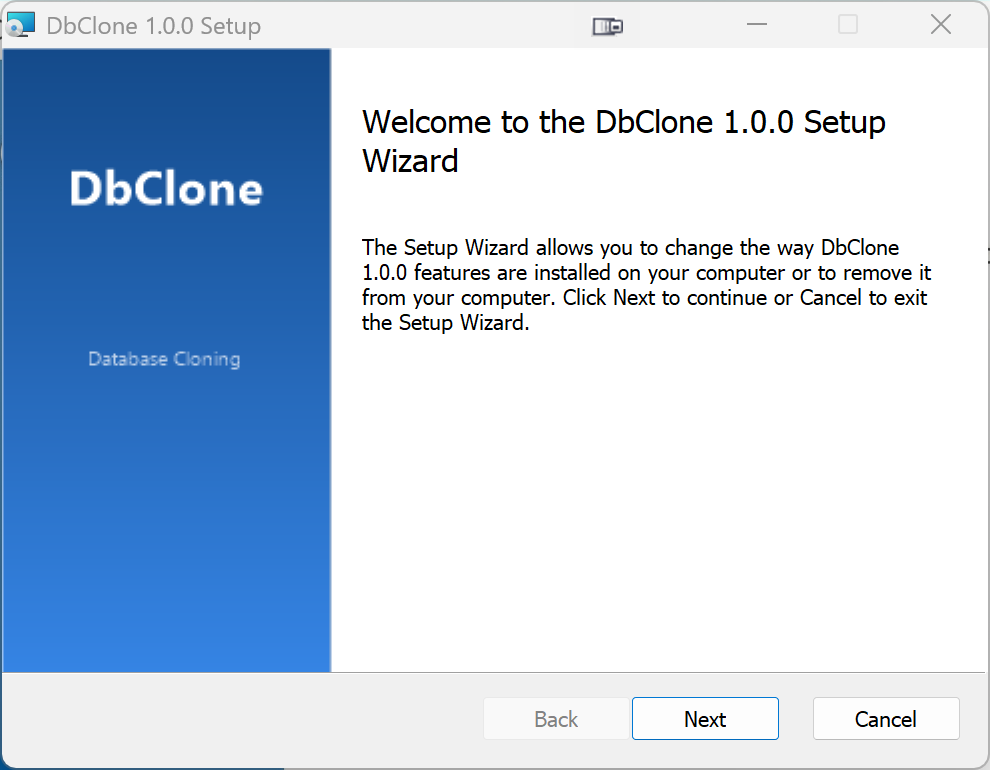

# Installation

## Download

Download the latest installer from [GitHub Releases](https://github.com/AlexNek/DbClone/releases):

- **`DbClone-Setup-x.y.z.exe`** — standard installer with Start Menu shortcut

## Install

Run the installer and follow the prompts. Admin rights are required — DbClone installs for all users to `C:\Program Files\DbClone`.

!!! warning "Windows SmartScreen Warning"
    On first run you may see a **"Windows protected your PC"** dialog from Microsoft Defender SmartScreen. This happens because the installer is not code-signed with a purchased certificate — it does **not** mean the software is unsafe.

    To proceed:

    1. Click **"More info"**
    2. Click **"Run anyway"**

    This is standard behavior for open-source applications distributed outside the Microsoft Store. You can verify the file integrity using the SHA-256 checksum published on the [Releases](https://github.com/AlexNek/DbClone/releases) page.

{ loading=lazy }

!!! info "No .NET runtime needed"
    DbClone ships self-contained. You don't need to install .NET separately.

## Silent Install

The installer is a WiX Burn bootstrapper. For deployment scripts or automation:

```batch
DbClone-Setup-x.y.z.exe /quiet      :: fully silent, no UI
DbClone-Setup-x.y.z.exe /passive    :: progress UI only, no interaction
```

To install the MSI directly without the wizard:

```batch
msiexec /i DbClone-x.y.z.msi /qn
```

## Auto-Update

DbClone checks for updates automatically on startup (after a 3-second delay). When a new version is available, a non-blocking banner appears at the top of the main window with **Update** and **What's new** buttons. Click **Update** to download and install, or dismiss the banner to continue working.

Updates are applied in-place — no uninstall needed.

You can also check manually: click the **About** button (ⓘ icon) in the toolbar, then click **Check for Updates** in the About dialog.

## Uninstall

Use Windows **Settings → Apps → DbClone → Uninstall**, or run the uninstaller from the install directory.

Your saved connections and settings are preserved in `%LOCALAPPDATA%\DbClone\` and are not removed on uninstall.
