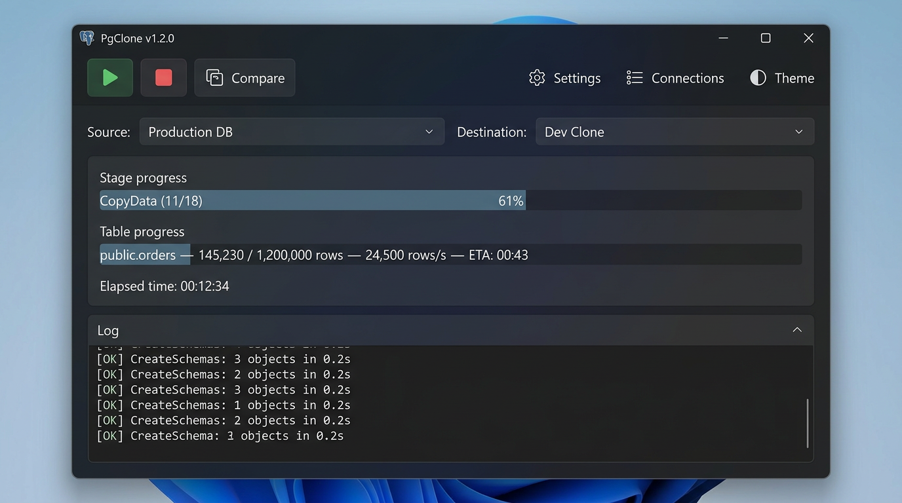

# DbClone User Manual

- :material-download: **[Installation](getting-started/installation.md)** — Download and install DbClone
- :material-rocket-launch: **[First Copy](getting-started/first-copy.md)** — Clone your first database in 5 minutes
- :material-connection: **[Connections](connections/managing-connections.md)** — Manage source and destination connections
- :material-content-copy: **[Copy Modes](copy-modes/overview.md)** — Full, Resume, Update, and Backup modes
- :material-compare: **[Comparison](comparison.md)** — Compare two databases side by side
- :material-wrench: **[Troubleshooting](troubleshooting.md)** — Common issues and solutions
- :material-lightbulb-on: **[Possible Future Features](roadmap.md)** — Ideas that wait for user requirements

## What is DbClone?

DbClone is a Windows desktop application for cloning and migrating PostgreSQL databases. It handles schema, data, extensions, and dependency ordering — purpose-built for moving databases off managed platforms (Supabase, Aiven, Neon, RDS) to vanilla PostgreSQL without losing schema fidelity.

{ loading=lazy }

## Why not pg_dump?

Standard tools (`pg_dump`, `pg_restore`, DBeaver, pgAdmin) work for simple PostgreSQL-to-PostgreSQL copies. They break when your source is a managed platform:

| Problem | Standard tools | DbClone |
|---------|---------------|--------|
| Extension-owned objects | Tries to recreate them → fails | Detects via `pg_depend`, skips automatically |
| Managed schemas (auth, storage) | Permission denied | **Platform definition files** (`.platform`) auto-detect the host, resolve version-specific schemas and extensions |
| Dependency ordering | Wrong order → cascading failures | Topological sort with cycle detection |
| Interrupted copy | Start over from scratch | Resume mode — copies only what's missing |
| Silent schema failures | Objects missing on destination | **Object count validation** — verifies tables, indexes, views, sequences, functions, triggers |
| No visibility | CLI output | Real-time progress, ETA, live log panel |

## System Requirements

- Windows 10 or 11 (x64)
- Source and destination must be PostgreSQL (any version ≥ 9.6)
- No .NET runtime needed — ships self-contained
