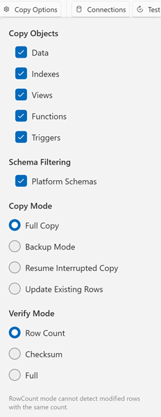

# Options Reference

Configure what DbClone copies and how it behaves.

## Object Selection

Toggle which object types to include in the copy:

| Option | Default | Description |
|--------|---------|-------------|
| **Copy Data** | ✅ On | Copy table rows (disable for schema-only clone) |
| **Copy Indexes** | ✅ On | Create secondary indexes. Primary key indexes are always created with the table structure and cannot be skipped |
| **Copy Views** | ✅ On | Create views |
| **Copy Functions** | ✅ On | Create functions and procedures |
| **Copy Triggers** | ✅ On | Create triggers |

!!! note "Always copied"
    Constraints (foreign keys / check constraints), sequences, materialized views, RLS policies, and object comments are always copied — the current UI has no toggles for them.

## Schema Filtering

| Option | Default | Description |
|--------|---------|-------------|
| **Platform Schemas** | ✅ On | Include platform-managed schemas (e.g. Supabase `auth`, `storage`, `realtime`). Uncheck to exclude schemas owned by non-login service roles. System schemas (`pg_catalog`, `information_schema`, `pg_toast`) are always excluded regardless of this setting |

### Platform-Aware Schema Resolution

DbClone uses **`.platform` definition files** to determine which schemas and extensions belong to each hosting platform. When you connect, DbClone auto-detects the platform from the hostname and resolves the applicable schemas and extensions based on the server version.

| Platform | Detection Pattern | Default Port | SSL Mode |
|----------|------------------|--------------|----------|
| **PostgreSQL** (vanilla) | Fallback (no pattern match) | 5432 | Prefer |
| **Supabase** | `*.supabase.co` | 5432 | Require |
| **Aiven** | `*.aivencloud.com` | 11521 | Require |
| **Neon** | `*.neon.tech` | 5432 | Require |

Each platform definition includes version-specific entries that list:

- **System schemas** — engine-internal schemas always excluded (e.g. `pg_catalog`, `information_schema`, `pg_toast`)
- **Platform schemas** — provider-managed schemas excluded when "Platform Schemas" is unchecked (e.g. Supabase `auth`, `storage`, `realtime`, `graphql`, `vault`, etc.)
- **Platform extensions** — provider-managed extensions detected and skipped (e.g. `supabase_vault`, `pgsodium`, `pg_graphql`, `neon`, `aiven_extras`)

Supabase definitions cover PostgreSQL 15, 16, and 17 with version-specific extension lists (e.g. PG 17 drops `timescaledb`, `plv8`, `pgjwt`).

The platform definition files are loaded from the `platforms/postgresql/` directory in the installation folder. They can be updated without reinstalling the application.

{ loading=lazy }

## Copy Mode

| Mode | Description |
|------|-------------|
| **Full** | Complete clone — drops and recreates everything |
| **Resume** | Skip DDL, copy only missing/mismatched data |
| **Update** | Same as Resume (sync stale tables) |
| **Backup** | Create a new timestamped database and full-copy into it |

See [Copy Modes](copy-modes/overview.md) for detailed explanations.

## Verification Mode

Controls how DbClone validates the copy after data transfer:

| Mode | Description |
|------|-------------|
| **Row Count** | Compare `COUNT(*)` per table (fast) |
| **Checksum** | Compare MD5 hash of table content (thorough) |
| **Full** | Row count + checksum |

## Advanced Behavior

These values are built into DbClone and are not user-configurable (they may become options in a future release):

| Option | Behavior |
|--------|-------------|
| Batch size | 5000 rows per batch — used for progress reporting and for the INSERT fallback when binary COPY fails |
| Command timeout | Built-in, per-operation values: 30 seconds for general SQL, 5 minutes for long-running DDL and data-transfer commands, 10 seconds for connection probes |
| Connection keepalive | A heartbeat query (`SELECT 1`) is sent between pipeline stages to prevent proxy idle timeouts |

## Settings Persistence

All options are saved automatically when you change them. Settings file location:

```
%LOCALAPPDATA%\DbClone\settings.json
```

Settings include:

- Selected copy mode
- Verification mode
- Object toggles (data, indexes, functions, views, triggers)
- Platform schemas toggle
- Window position and size
- Theme preference (light/dark/system)
- Last used source and destination connections
- Selected connection group
- Compare log pane state and height
- Default clipboard export format
